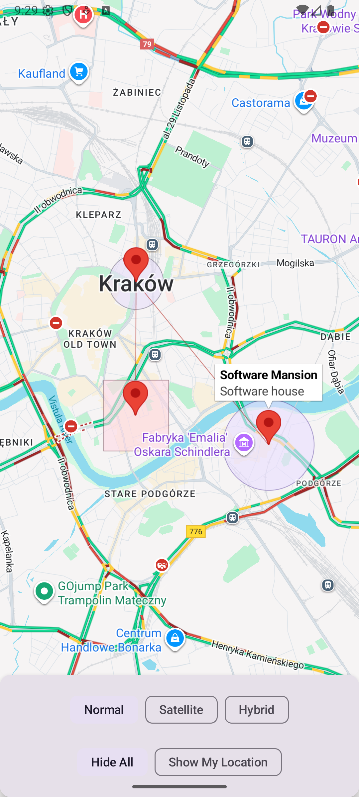

# KMP Maps

### Cross-platform map component for Kotlin Multiplatform Mobile using Google Maps on Android and Apple Maps on iOS

[](https://kotlinlang.org)
[](./LICENSE)

`kmp-maps` provides a unified map component for Kotlin Multiplatform Mobile applications, offering seamless integration with native map APIs on both Android and iOS platforms.

## Features

- **Cross-platform compatibility** - Single API for both Android and iOS
- **Native performance** - Uses Google Maps SDK on Android and Apple Maps (MapKit) on iOS
- **Compose Multiplatform** - Built with Jetpack Compose for modern UI development
- **Rich functionality** - Support for markers, circles, polygons, polylines, and custom styling
- **Interactive callbacks** - Handle user interactions like clicks, camera movements, and gestures
- **Location services** - Built-in location permission handling and user location display

## Installation

Add the library to your `build.gradle.kts`:

```kotlin
dependencies {
    implementation("todo")
}
```

## Configuration

### Android - Google Maps API Key

To use Google Maps on Android, you need to configure your API key in `AndroidManifest.xml`:

```xml
<meta-data
    android:name="com.google.android.geo.API_KEY"
    android:value="${MAPS_API_KEY}" />
```

You can also set it directly:
```xml
<meta-data
    android:name="com.google.android.geo.API_KEY"
    android:value="YOUR_API_KEY_HERE" />
```

#### Google Cloud API Setup

Before you can use Google Maps on Android, you need to register a Google Cloud API project and enable the Maps SDK for Android:

1. **Register a Google Cloud API project and enable the Maps SDK for Android**
   - Open your browser to the [Google API Manager](https://console.cloud.google.com/) and create a project
   - Once it's created, go to the project and enable the Maps SDK for Android

2. **Copy your app's SHA-1 certificate fingerprint**
   
   **For Google Play Store:**
   - Upload your app binary to Google Play Console at least once
   - Go to Google Play Console > (your app) > Release > Setup > App integrity > App signing
   - Copy the value of SHA-1 certificate fingerprint
   
   **For development builds:**
   - After the build is complete, go to your project's dashboard
   - Under Project settings > click Credentials
   - Under Application Identifiers, click your project's package name
   - Under Android Keystore copy the value of SHA-1 Certificate Fingerprint

3. **Create an API key**
   - Go to [Google Cloud Credential manager](https://console.cloud.google.com/apis/credentials) and click Create Credentials, then API Key
   - In the modal, click Edit API key
   - Under Key restrictions > Application restrictions, choose Android apps
   - Under Restrict usage to your Android apps, click Add an item
   - Add your package name to the package name field
   - Then, add the SHA-1 certificate fingerprint's value from step 2
   - Click Done and then click Save

4. **Add the API key to your project**
   - Copy your API Key into your `AndroidManifest.xml` as shown above
   - Create a new build, and you can now use the Google Maps API on Android

### iOS - Apple Maps

No additional configuration is required for Apple Maps on iOS.

## Permissions

To display the user's location on the map, you need to declare and request location permissions:

### Android

Add the following permissions to your `AndroidManifest.xml`:
```xml
<uses-permission android:name="android.permission.ACCESS_FINE_LOCATION" />
<uses-permission android:name="android.permission.ACCESS_COARSE_LOCATION" />
```

### iOS

Add the following key to your `Info.plist`:
```xml
<key>NSLocationWhenInUseUsageDescription</key>
<string>Allow this app to use your location</string>
```

## Usage

```kotlin
@Composable
fun MyMapScreen() {
    Map(
        modifier = Modifier.fillMaxSize(),
        properties = MapProperties(
            isMyLocationEnabled = true,
            mapType = MapType.NORMAL,
        ),
        uiSettings = MapUISettings(
            myLocationButtonEnabled = true,
            compassEnabled = true
        ),
        cameraPosition = CameraPosition(
            coordinates = Coordinates(latitude = 50.0619, longitude = 19.9373),
            zoom = 13f
        ),
        markers = listOf(
            MapMarker(
                coordinates = Coordinates(latitude = 50.0486, longitude = 19.9654),
                title = "Software Mansion",
                androidSnippet = "Software house"
            )
        ),
        onMarkerClick = { marker ->
            println("Marker clicked: ${marker.title}")
        },
        onMapClick = { coordinates ->
            println("Map clicked at: ${coordinates.latitude}, ${coordinates.longitude}")
        }
    )
}
```

## Screenshots

 | iOS (Apple Maps) | Android (Google Maps) |
|------------------|----------------------|
|  |  |
| *Map view with circles, polygon, polylines and markers on iOS* | *Map view with circles, polygon, polylines and markers on Android* |


## Platform Support

- **Android**: Uses Google Maps SDK
- **iOS**: Uses Apple Maps (MapKit)

## Examples

Check out the sample project in the `/sample` directory for complete usage examples.

## Contributing

We welcome contributions! Please feel free to submit a Pull Request.

## License

KMP Maps library is licensed under [The MIT License](./LICENSE).

## Credits

This project has been built and is maintained thanks to the support from [Software Mansion](https://swmansion.com)

[](https://swmansion.com)

## KMP Maps is created by Software Mansion

Since 2012 [Software Mansion](https://swmansion.com) is a software agency with experience in building web and mobile apps. We are Core React Native Contributors and experts in dealing with all kinds of React Native and Kotlin Multiplatform issues. We can help you build your next dream product – [Hire us](https://swmansion.com/contact/projects?utm_source=kmpmaps&utm_medium=readme).