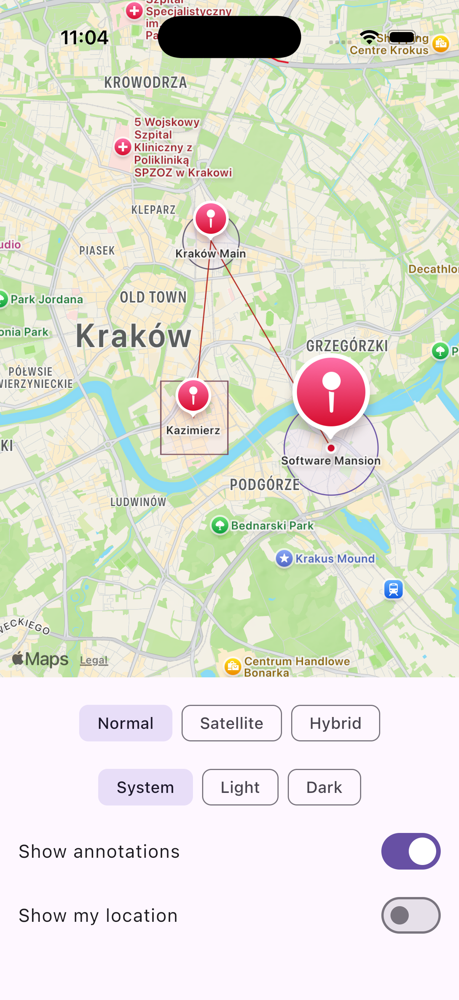
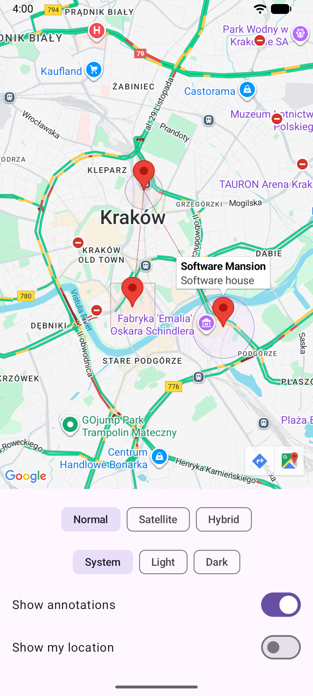

[](https://kotlinlang.org)
[](./LICENSE)
[](https://central.sonatype.com/artifact/com.swmansion.kmpmaps/kmp-maps)

`kmp-maps` provides a unified map component for Compose Multiplatform applications, offering seamless integration with native map APIs on both Android and iOS platforms.

## 🎯 See It in Action

Check out the sample project in the `/sample` directory for complete usage examples.

| iOS (Apple Maps) | Android (Google Maps) |
|:---:|:---:|
|  |  |
| *Map view with circles, polygon, polylines and markers on iOS* | *Map view with circles, polygon, polylines and markers on Android* |


## ✨ Features

- **Cross-platform compatibility** - Single API for both Android and iOS
- **Native performance** - Uses Google Maps SDK on Android and Apple Maps (MapKit) on iOS
- **Compose Multiplatform** - Built with Compose Multiplatform for modern UI development
- **Rich functionality** - Support for markers, circles, polygons, polylines, and custom styling
- **Interactive callbacks** - Handle user interactions like clicks, camera movements, and gestures
- **Location services** - Built-in location permission handling and user location display

## 🚀 Usage

```kotlin
@Composable
fun MyMapScreen() {
    Map(
        modifier = Modifier.fillMaxSize(),
        properties = MapProperties(
            isMyLocationEnabled = true,
            mapType = MapType.NORMAL,
        ),
        uiSettings = MapUISettings(
            myLocationButtonEnabled = true,
            compassEnabled = true
        ),
        cameraPosition = CameraPosition(
            coordinates = Coordinates(latitude = 50.0619, longitude = 19.9373),
            zoom = 13f
        ),
        markers = listOf(
            Marker(
                coordinates = Coordinates(latitude = 50.0486, longitude = 19.9654),
                title = "Software Mansion",
                androidSnippet = "Software house"
            )
        ),
        onMarkerClick = { marker ->
            println("Marker clicked: ${marker.title}")
        },
        onMapClick = { coordinates ->
            println("Map clicked at: ${coordinates.latitude}, ${coordinates.longitude}")
        }
    )
}
```

## 📦 Installation

### ✅ Recommended: Using Gradle Version Catalogs

First, add the library to your `gradle/libs.versions.toml` file:

```toml
[versions]
kmpMaps = "0.1.0"

[libraries]
swmansion-kmpMaps = { module = "com.swmansion.kmpmaps:kmp-maps", version.ref = "kmpMaps" }
```

Then add it to your `build.gradle.kts`:

```kotlin
dependencies {
    implementation(libs.swmansion.kmpMaps)
}
```

### 🔧 Alternative: Direct Dependency Declaration

If you're not using Gradle version catalogs, you can add the library directly to your `build.gradle.kts`:

```kotlin
dependencies {
    implementation("com.swmansion.kmpmaps:kmp-maps:0.1.0")
}
```

## 📚 API Reference

Check out our [dedicated documentation page](https://docs.swmansion.com/kmp-maps/) for the complete API reference.

## ⚙️ Configuration

### 🤖 Android - Google Maps API Key

To use Google Maps on Android, you need to configure your API key in `AndroidManifest.xml`:

```xml
<meta-data
    android:name="com.google.android.geo.API_KEY"
    android:value="YOUR_API_KEY" />
```

For detailed setup instructions, see our [Google Cloud API Setup Guide](docs/GOOGLE_CLOUD_API_SETUP.md).

### 🍎 iOS - Apple Maps

No additional configuration is required for Apple Maps on iOS.

## 🔐 Permissions

To display the user's location on the map, you need to declare and request location permissions:

### 🤖 Android

Add the following permissions to your `AndroidManifest.xml`:
```xml
<uses-permission android:name="android.permission.ACCESS_FINE_LOCATION" />
<uses-permission android:name="android.permission.ACCESS_COARSE_LOCATION" />
```

### 🍎 iOS

Add the following key to your `Info.plist`:
```xml
<key>NSLocationWhenInUseUsageDescription</key>
<string>Allow this app to use your location</string>
```

## 🤝 Contributing

We welcome contributions! Please feel free to submit a Pull Request.


## KMP Maps is created by Software Mansion

[](https://swmansion.com)

Since 2012 [Software Mansion](https://swmansion.com) is a software agency with
experience in building web and mobile apps. We are Core React Native
Contributors and experts in dealing with all kinds of React Native issues. We
can help you build your next dream product –
[Hire us](https://swmansion.com/contact/projects?utm_source=typegpu&utm_medium=readme).

Made by [@software-mansion](https://github.com/software-mansion) and
[community](https://github.com/software-mansion/kmp-maps/graphs/contributors) 💛
<br><br>
<a href="https://github.com/software-mansion/kmp-maps/graphs/contributors">

</a>