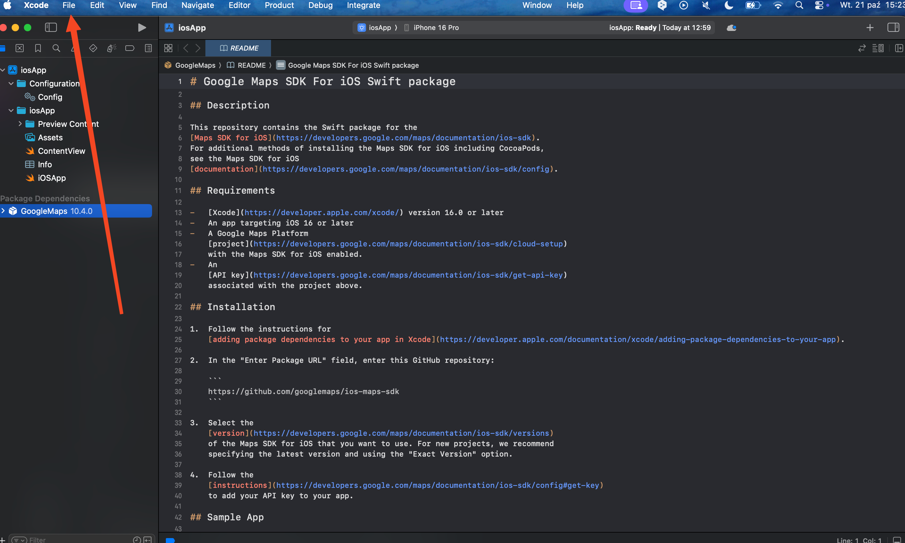
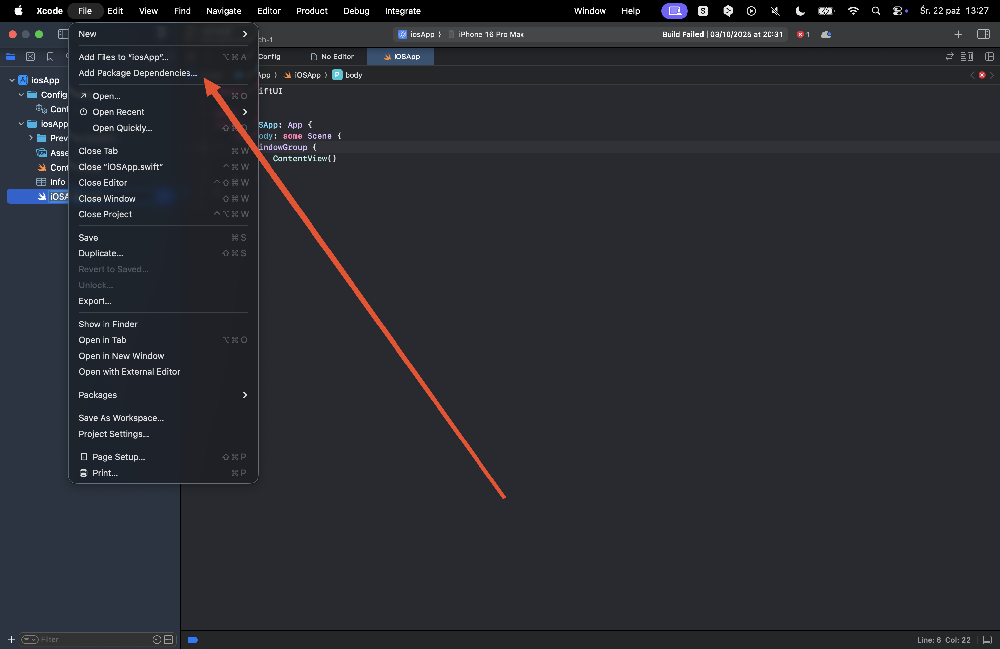
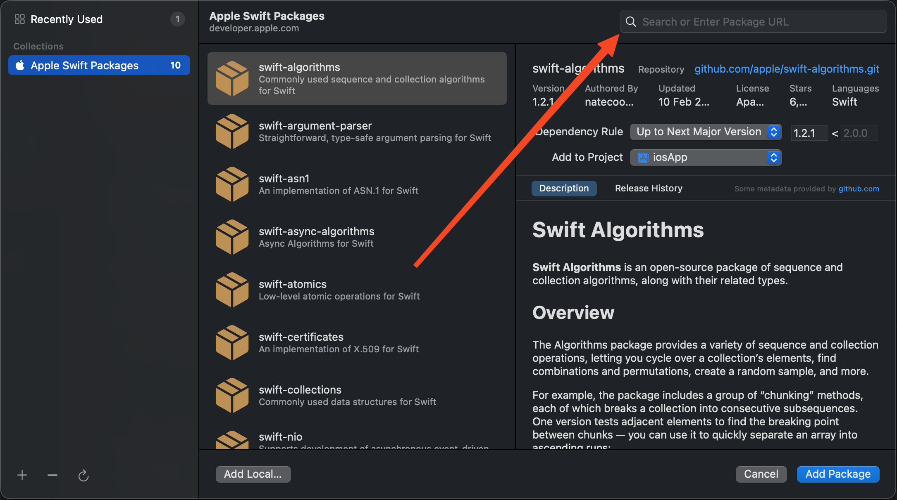

# 🗺️ Google Maps iOS Setup Guide

This guide will walk you through setting up Google Maps SDK for iOS in your project.

## 📋 Requirements

Before starting, make sure you have:

-   Xcode 16.0 or later installed
-   A Google Maps Platform project with Maps SDK for iOS enabled
-   An API key for Google Maps

## 🚀 Step-by-Step Installation

### Step 1: 📱 Open Your iOS Project

1. Open Xcode
2. Open your iOS project (`.xcodeproj` file)

### Step 2: 📦 Access Package Dependencies

1. In Xcode, click on the **File** menu in the top menu bar
   
2. Select **Add Package Dependencies...** from the dropdown menu
   

### Step 3: 🔍 Add Google Maps SDK Package

1. In the "Add Package Dependencies" dialog, you'll see a search field at the top
   
2. In the search field, enter the following URL: https://github.com/googlemaps/ios-maps-sdk
3. Press Enter or click the search button
4. Select the Google Maps package from the results
5. Choose the 10.4.0 version
6. Click **Add Package** to install the dependency

### Step 4: 🔑 Configure API Key

1. In your Xcode project navigator, locate and open the `Info.plist` file
2. Add the following entries to configure your Google Maps API key:

```xml
<key>GoogleMapsAPIKey</key>
<string>YOUR_API_KEY_HERE</string>
```

Replace `YOUR_API_KEY_HERE` with your actual Google Maps API key.

### Step 5: ⚙️ Configure Gradle with Cocoapods

1. Add version above `[plugins]` section:
    ```kotlin
   version = "Your.app-version"
   ```

2. Add to the `[plugins]` section:

    ```kotlin
    kotlin("native.cocoapods")
    ```


3. Add to the `[kotlin]` section:

    ```kotlin
     cocoapods {
        summary = "Your summary"
        homepage = "Link to your homepage/repository"
        version = "Your.app-version"
        ios.deploymentTarget = "16.0"
   
        framework {
            baseName = "Your app name"
        }
   
        pod("GoogleMaps") { version = "10.4.0" } 
     }
    ```
